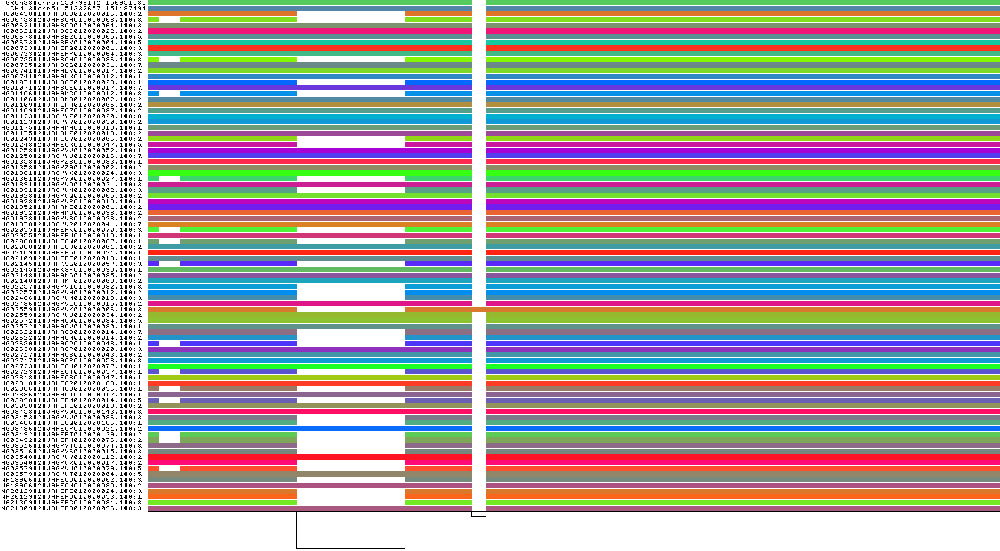

# IRGM Deletions

Looking at region around IRGM gene:

- deletions upstream of IRGM
- IRGM (GRCh38 coordinates): `GRCh38#chr5	150846521	150900736   IRGM`
- Wider region: `GRCh38#chr5	150796521	150950736	IRGM_REGION`

Download minigraph-cactus graph for chr5 in `og` format (`og` is graph format used by `odgi`):

```
wget https://s3-us-west-2.amazonaws.com/human-pangenomics/pangenomes/freeze/freeze1/minigraph-cactus/hprc-v1.1-mc-grch38/hprc-v1.1-mc-grch38.chroms/chr5.full.og
```

Grab chromosome 22 while we're at it (used later):

```{bash}
wget https://s3-us-west-2.amazonaws.com/human-pangenomics/pangenomes/freeze/freeze1/minigraph-cactus/hprc-v1.1-mc-grch38/hprc-v1.1-mc-grch38.chroms/chr22.full.og
```

Can get some info about the chromosome 5 graph from `odgi stats`:

```{bash}
odgi stats -i chr5.full.og -S
```

```
#length     nodes	edges	paths	steps
549588408	5020820	6987667	920	264452630
```

Base composition:

```{bash}
odgi stats -i chr5.full.og -b
```


```
A	164267909
C	109394476
G	107371375
N	2555066
T	165999582
```

Let's pull out a sub-region (easier to work with too).

Create a `.bed` file for the IRGM region (e.g., `nano irgm-region.bed`):

```{bash}
GRCh38#chr5	150796521	150950736	IRGM_REGION
```

We can use `odgi` to extract this region from the full graph of chromosome 5:

```{bash}
odgi extract -i chr5.full.og -o irgm-region-chr5.og -b irgm-region-chr5.bed -c 0 -E --threads 2 -P
```

Stats:

```{bash}
odgi stats -i  irgm-region-chr5.og -S
```

```
#length	nodes	edges	paths	steps
159179	3671	5040	90      212871
```

Plot the extracted graph:

```{bash}
odgi sort -i irgm-region-chr5.og -o - -O | odgi viz -i - -o irgm_region.png -s '#'
```



Haplotypes - note, the output is WIDE (lists all nodes: 3671 for teh IRGM region), so output is truncated to first 10 rows and columns:

```{bash}
odgi paths -i irgm-region-chr5.og -H | cut -d$'\t' -f1-10 | head
```

```
path.name	path.length	path.step.count	node.4010347	node.4010348	node.4010349	node.4010350	node.4010351	node.4010352	node.4010353
GRCh38#chr5:150796142-150951030	154888	2437	1	1	0	1	1	0	1
CHM13#chr5:151332657-151487494	154837	2425	1	1	0	1	1	0	1
HG00438#1#JAHBCB010000016.1#0:23808666-23943440	134774	2293	1	0	1	1	0	1	1
HG00438#2#JAHBCA010000008.1#0:30185874-30316718	130844	2248	1	1	0	1	0	1	1
HG00621#1#JAHBCD010000064.1#0:30181039-30335880	154841	2427	1	1	0	1	1	0	1
HG00621#2#JAHBCC010000022.1#0:23800667-23955508	154841	2427	1	1	0	1	1	0	1
HG00673#1#JAHBBZ010000005.1#0:52568376-52723213	154837	2424	1	1	0	1	1	0	1
HG00673#2#JAHBBY010000004.1#0:52585809-52740645	154836	2423	1	1	0	1	1	0	1
HG00733#1#JAHEPQ010000001.1#0:30540387-30695222	154835	2423	1	1	0	1	1	0	1
```

One row per haplotype:

```{bash}
odgi paths -i irgm-region-chr5.og -H | tail -n+2 | wc -l
```

```
90
```

Can extract just the haplotype info to do some checking:

```{bash}
odgi paths -i irgm-region-chr5.og -H > irgm-region-paths-haplotypes.txt
```

Extract just the path name and length:

```{bash}
cat irgm-region-paths-haplotypes.txt | cut -d$'\t' -f 1-2  | head
```

Count number of paths per sample:

```{bash}
cat irgm-region-paths-haplotypes.txt | tail -n+2 | cut -d'#' -f1 | sort | uniq -c
```

Each sample has 2 paths (one per haplotype), whereas reference genomes just have one (output truncated):

```{bash}
      1 CHM13
      1 GRCh38
      2 HG00438
      2 HG00621
      2 HG00673
      2 HG00733
      2 HG00735
      2 HG00741
      2 HG01071
      2 HG01106
```

This is a fairly simple region through.  If we do the same thing for a whole chromosome, things look a little more complex (I've used chr22 here, as extracting the paths for chr5 takes a long time, although doing chr22 also takes a while):

```{bash}
odgi paths -i chr22.full.og -H > chr22-paths-haplotypes.txt
```

```{bash}
cat chr22-paths-haplotypes.txt | tail -n+2 | cut -d'#' -f1-2 | cut -d$'\t' -f1 | sort | uniq -c
```

Can see that some sample haplotypes have multiple paths:

```
      1 CHM13#chr22
      1 GRCh38#chr22
      4 HG00438#1
      2 HG00438#2
      3 HG00621#1
      2 HG00621#2
      7 HG00673#1
      4 HG00673#2
      3 HG00733#1
      3 HG00733#2
```

Let's look at HG00438

```{bash}
grep HG00438 chr22-paths-haplotypes.txt | cut -d$'\t' -f1-3
```

```
HG00438#1#JAHBCB010000005.1#0	39720081    635948
HG00438#1#JAHBCB010000087.1#0	4368431	   112354
HG00438#1#JAHBCB010000195.1#0	553482	   16292
HG00438#1#JAHBCB010000243.1#0	89841	   1789
HG00438#2#JAHBCA010000050.1#0	32170210	643272
HG00438#2#JAHBCA010000084.1#0	12116057	109397
```

Columns are: `path.name`,	`path.length`,	`path.step.count`