# IRGM Deletions

Looking at region around IRGM gene:

- deletions upstream of IRGM
- IRGM (GRCh38 coordinates): `GRCh38#chr5	150846521	150900736   IRGM`
- Wider region: `GRCh38#chr5	150796521	150950736	IRGM_REGION`

## ODGI 

ODGI: "optimized dynamic genome/graph implementation"

- Documentation: https://odgi.readthedocs.io/en/latest/
- Paper: https://academic.oup.com/bioinformatics/article/38/13/3319/6585331

Download minigraph-cactus graph for chr5 in `og` format (`og` is graph format used by `odgi`):

```
wget https://s3-us-west-2.amazonaws.com/human-pangenomics/pangenomes/freeze/freeze1/minigraph-cactus/hprc-v1.1-mc-grch38/hprc-v1.1-mc-grch38.chroms/chr5.full.og
```

Grab chromosome 22 while we're at it (used later):

```{bash}
wget https://s3-us-west-2.amazonaws.com/human-pangenomics/pangenomes/freeze/freeze1/minigraph-cactus/hprc-v1.1-mc-grch38/hprc-v1.1-mc-grch38.chroms/chr22.full.og
```

Can get some info about the chromosome 5 graph from `odgi stats`:

```{bash}
odgi stats -i chr5.full.og -S
```

```
#length     nodes    edges    paths      steps
549588408   5020820  6987667    920  264452630
```

Base composition:

```{bash}
odgi stats -i chr5.full.og -b
```


```
A	164267909
C	109394476
G	107371375
N	2555066
T	165999582
```

Let's pull out a sub-region (easier to work with too).

Create a `.bed` file for the IRGM region (e.g., `nano irgm-region-chr5.bed`):

```{bash}
GRCh38#chr5	150796521	150950736	IRGM_REGION
```

We can use `odgi` to extract this region from the full graph of chromosome 5:

```{bash}
odgi extract -i chr5.full.og -o irgm-region-chr5.og -b irgm-region-chr5.bed -c 0 -E --threads 2 -P
```

Stats:

```{bash}
odgi stats -i  irgm-region-chr5.og -S
```

```
#length	nodes	edges	paths	steps
159179	3671	5040	90      212871
```

Plot the extracted graph:

```{bash}
odgi sort -i irgm-region-chr5.og -o - -O | odgi viz -i - -o irgm_region.png -s '#'
```


Sort and optimise graph:

```{bash}
odgi sort -i irgm-region-chr5.og -O -o irgm-region-chr5-sorted-optimised.og 
```

Generate layout

```{bash}
odgi layout -i irgm-region-chr5-sorted-optimised.og -o irgm-region-chr5.lay
```

Create 2D plot:

```{bash}
odgi draw -i irgm-region-chr5-sorted-optimised.og -p irgm_region-2d.png -c irgm-region-chr5.lay
```

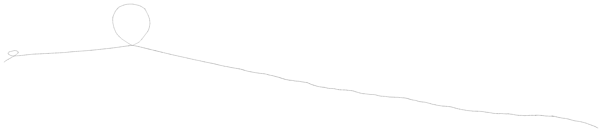

### Alternative sorts

From `odgi sort`:

```
-L, --paths-min        Sort paths by their lowest contained node identifier.
-M, --paths-max        Sort paths by their highest contained node identifier.
-A, --paths-avg        Sort paths by their average contained node identifier.
-R, --paths-avg-rev    Sort paths in reverse by their average contained node identifier.
```

```{bash}
# L: paths-min
odgi sort -L -i irgm-region-chr5.og -o - -O | odgi viz -i - -o irgm_region-L-sort.png -s '#'
```


```{bash}
# M: paths-max
odgi sort -M -i irgm-region-chr5.og -o - -O | odgi viz -i - -o irgm_region-M-sort.png -s '#'
```

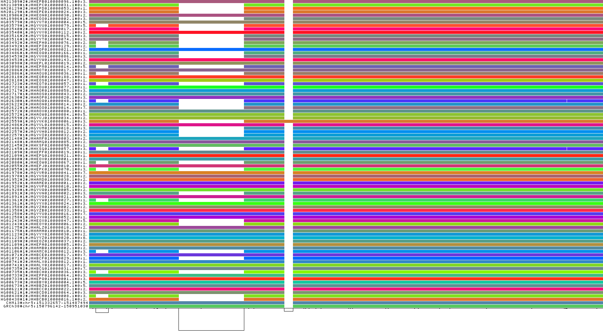

```{bash}
# A: paths-avg
odgi sort -A -i irgm-region-chr5.og -o - -O | odgi viz -i - -o irgm_region-A-sort.png -s '#'
```

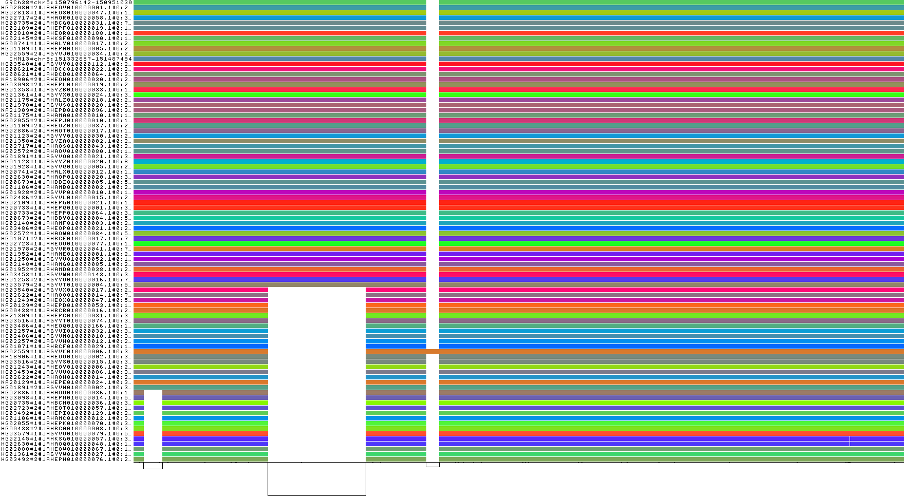

```{bash}
# R: paths-avg-rev
odgi sort -R -i irgm-region-chr5.og -o - -O | odgi viz -i - -o irgm_region-R-sort.png -s '#'
```

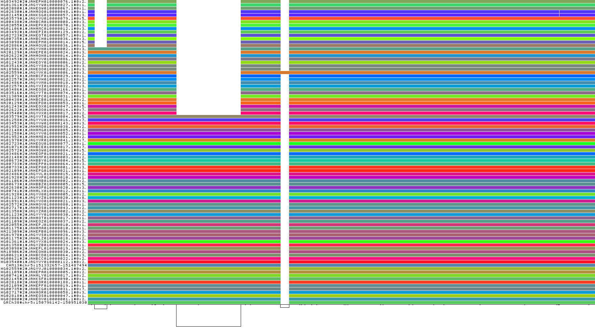


### Haplotypes 

Note, the output is WIDE (lists all nodes: 3671 for the IRGM region), so output is truncated to first 10 rows and columns:

```{bash}
odgi paths -i irgm-region-chr5.og -H | cut -d$'\t' -f1-10 | head
```

```
path.name	path.length	path.step.count	node.4010347	node.4010348	node.4010349	node.4010350	node.4010351	node.4010352	node.4010353
GRCh38#chr5:150796142-150951030	154888	2437	1	1	0	1	1	0	1
CHM13#chr5:151332657-151487494	154837	2425	1	1	0	1	1	0	1
HG00438#1#JAHBCB010000016.1#0:23808666-23943440	134774	2293	1	0	1	1	0	1	1
HG00438#2#JAHBCA010000008.1#0:30185874-30316718	130844	2248	1	1	0	1	0	1	1
HG00621#1#JAHBCD010000064.1#0:30181039-30335880	154841	2427	1	1	0	1	1	0	1
HG00621#2#JAHBCC010000022.1#0:23800667-23955508	154841	2427	1	1	0	1	1	0	1
HG00673#1#JAHBBZ010000005.1#0:52568376-52723213	154837	2424	1	1	0	1	1	0	1
HG00673#2#JAHBBY010000004.1#0:52585809-52740645	154836	2423	1	1	0	1	1	0	1
HG00733#1#JAHEPQ010000001.1#0:30540387-30695222	154835	2423	1	1	0	1	1	0	1
```

One row per haplotype:

```{bash}
odgi paths -i irgm-region-chr5.og -H | tail -n+2 | wc -l
```

```
90
```

Can extract just the haplotype info to do some checking:

```{bash}
odgi paths -i irgm-region-chr5.og -H > irgm-region-paths-haplotypes.txt
```

Extract just the path name and length:

```{bash}
cat irgm-region-paths-haplotypes.txt | cut -d$'\t' -f 1-2  | head
```

Count number of paths per sample:

```{bash}
cat irgm-region-paths-haplotypes.txt | tail -n+2 | cut -d'#' -f1 | sort | uniq -c
```

Each sample has 2 paths (one per haplotype), whereas reference genomes just have one (output truncated):

```{bash}
      1 CHM13
      1 GRCh38
      2 HG00438
      2 HG00621
      2 HG00673
      2 HG00733
      2 HG00735
      2 HG00741
      2 HG01071
      2 HG01106
```

This is a fairly simple region through.  If we do the same thing for a whole chromosome, things look a little more complex (I've used chr22 here, as extracting the paths for chr5 takes a long time, although doing chr22 also takes a while):

```{bash}
odgi paths -i chr22.full.og -H > chr22-paths-haplotypes.txt
```

```{bash}
cat chr22-paths-haplotypes.txt | tail -n+2 | cut -d'#' -f1-2 | cut -d$'\t' -f1 | sort | uniq -c
```
 
Can see that some sample haplotypes have multiple paths:

```
      1 CHM13#chr22
      1 GRCh38#chr22
      4 HG00438#1
      2 HG00438#2
      3 HG00621#1
      2 HG00621#2
      7 HG00673#1
      4 HG00673#2
      3 HG00733#1
      3 HG00733#2
```

Let's look at HG00438

```{bash}
grep -E -- 'path|HG00438' chr22-paths-haplotypes.txt | cut -d$'\t' -f1-3
```

```
path.name                       path.length  path.step.count
HG00438#1#JAHBCB010000005.1#0	39720081     635948
HG00438#1#JAHBCB010000087.1#0	4368431      112354
HG00438#1#JAHBCB010000195.1#0	553482       16292
HG00438#1#JAHBCB010000243.1#0	89841        1789
HG00438#2#JAHBCA010000050.1#0	32170210     643272
HG00438#2#JAHBCA010000084.1#0	12116057     109397
```

### Gene arrows

Create a `.bed` file for the IRGM gene (e.g., `nano irgm-chr5.bed`):

```{bash}
GRCh38#chr5	150846521	150900736      IRGM
```

Also, a better sort (which groups together the deletion samples - "A" sort from above) would be:

```
odgi sort -A -i irgm-region-chr5.og -O -o irgm-region-chr5-sorted-optimised-v2.og 
```

Following code at:

https://odgi.readthedocs.io/en/latest/rst/tutorials/injecting_gene_arrows.html

```{bash}
odgi paths -i irgm-region-chr5-sorted-optimised-v2.og -L  | grep GRC
```

```
GRCh38#chr5:150796142-150951030
```

```{bash}
more irgm-region-chr5.bed
```

```
GRCh38#chr5	150796521	150950736	IRGM_REGION
```

This doesn't line up with the region in the graph *(I don't really understand this).*

```{bash}
odgi procbed -i irgm-region-chr5-sorted-optimised-v2.og -b irgm-chr5.bed > irgm-chr5-adj.bed
```

Now we have (coordinates relate to start of subgraph):

```{bash}
more irgm-chr5-adj.bed
```

```
GRCh38#chr5:150796142-150951030	50379	104594	IRGM
```

```{bash}
odgi inject -i irgm-region-chr5-sorted-optimised-v2.og -b irgm-chr5-adj.bed -o - | odgi paths -i - -L | tail -3 > irgm-chr5-gene-names.txt
more irgm-chr5-gene-names.txt
```

Final line shows gene added as path: 

```
NA21309#1#JAHEPC010000031.1#0:30146479-30281260
NA21309#2#JAHEPB010000096.1#0:30170591-30325408
IRGM
```

```{bash}
odgi inject -i irgm-region-chr5-sorted-optimised-v2.og -b irgm-chr5-adj.bed -o irgm-region-chr5-sorted-optimised-INJECT-GENE.og
```

```{bash}
odgi viz -i irgm-region-chr5-sorted-optimised-INJECT-GENE.og -o irgm_region-GENE.png
```

IRGM is the path at the very bottom.

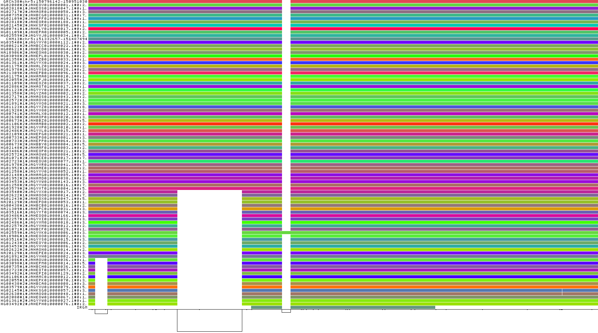

Generate a subset of paths 

```{bash}
# GRCh38 path
odgi paths -i irgm-region-chr5-sorted-optimised-INJECT-GENE.og -L | grep GRCh38 > irgm-region-GENE-path-subset.txt

# CHM13 path
odgi paths -i irgm-region-chr5-sorted-optimised-INJECT-GENE.og -L | grep CHM13 >> irgm-region-GENE-path-subset.txt

# Final 9 deletion samples, and IRGM (i.e., last 10 paths)
odgi paths -i irgm-region-chr5-sorted-optimised-INJECT-GENE.og -L | tail -10   >> irgm-region-GENE-path-subset.txt

# Check file:
more irgm-region-GENE-path-subset.txt
```

```
GRCh38#chr5:150796142-150951030
CHM13#chr5:151332657-151487494
HG01106#1#JAHAMC010000012.1#0:30116983-30247833
HG02055#1#JAHEPK010000070.1#0:30224754-30355606
HG00438#2#JAHBCA010000008.1#0:30185874-30316718
HG03579#1#JAGYVU010000079.1#0:52570852-52701684
HG02145#1#JAHKSG010000057.1#0:30202344-30333010
HG02630#1#JAHAOQ010000048.1#0:1976065-2106730
HG02080#1#JAHEOW010000067.1#0:17823013-17953847
HG01361#2#JAGYYW010000027.1#0:17815618-17946440
HG03492#2#JAHEPH010000076.1#0:23808489-23939313
IRGM
```

Also need a file containing teh gene names (in this case there iss only one, IRGM):

```
echo IRGM > gene-names.txt
```

```{bash}
odgi untangle -R gene-names.txt -i irgm-region-chr5-sorted-optimised-INJECT-GENE.og -j 0.5 -t 4 -g > irgm-ggplot-genes.tsv
head -10 irgm-ggplot-genes.tsv
```

Just select a subset:

```{bash}
cat irgm-ggplot-genes.tsv | grep '^mol\|GRCh38\|CHM13\|^IRGM\|HG01243#2\|HG01071#1\|HG00741#2\|HG00741#1' > irgm-ggplot-genes-path-subset.tsv
more irgm-ggplot-genes-path-subset.tsv
```

```
molecule	gene	start	end	strand
GRCh38#chr5:150796142-150951030	IRGM	50379	104415	1
HG00741#1#JAHALY010000017.1#0:23804192-23959081	IRGM	50295	104503	0
CHM13#chr5:151332657-151487494	IRGM	50362	104398	1
HG00741#2#JAHALX010000012.1#0:117550454-117705290	IRGM	50360	104396	1
HG01243#2#JAHEOX010000047.1#0:52576012-52710838	IRGM	30321	84355	1
HG01071#1#JAHBCF010000029.1#0:117890067-118024850	IRGM	30290	84330	1
IRGM	IRGM	0	54215	1
```

In R:

```{r}
library(ggplot2)
library(gggenes)
x = read.delim('irgm-ggplot-genes-path-subset.tsv')
ggplot(x, aes(xmin=start, xmax=end, y=molecule, fill=gene, forward=strand)) + geom_gene_arrow()
```

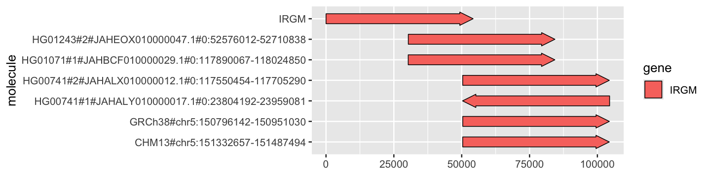

Note:

- IRGM path starts at zero, because there is no other information in the path (except for the gene).
- Next two paths start earlier than the others because they contain the short less frequent
  deletion nearer to the start of the region (so have less DNA sequence before the IRGM gene starts.
- Final four paths are from (larger) deletion samples, but one has orientation wrong - fix this
  with the code below.

```{bash}
odgi flip -i irgm-region-chr5-sorted-optimised-INJECT-GENE.og -o - -t 4 \
    | odgi untangle -R gene-names.txt -i - -j 0.5 -t 4 -g \
    | grep '^mol\|GRCh38\|CHM13\|^IRGM\|HG01243#2\|HG01071#1\|HG00741#2\|HG00741#1' > irgm-ggplot-genes-path-subset-flip.tsv
```

In R:

```{r}
library(ggplot2)
library(gggenes)
y = read.delim('irgm-ggplot-genes-path-subset-flip.tsv')
ggplot(y, aes(xmin=start, xmax=end, y=molecule, fill=gene, forward=strand)) + geom_gene_arrow()
```

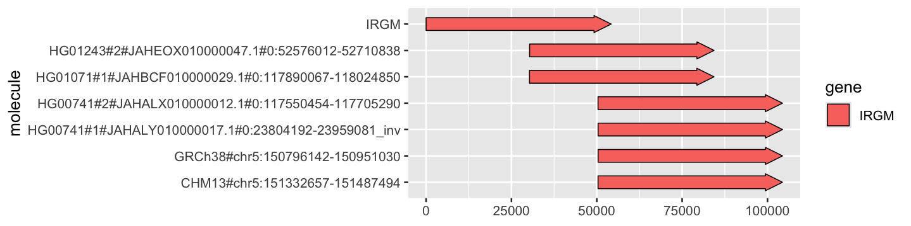

NB - can check in R that the "flipping" has just altered the strand information:

```{r}
x
```

```
                                           molecule gene start    end strand
1                   GRCh38#chr5:150796142-150951030 IRGM 50379 104415      1
2   HG00741#1#JAHALY010000017.1#0:23804192-23959081 IRGM 50295 104503      0
3                    CHM13#chr5:151332657-151487494 IRGM 50362 104398      1
4 HG00741#2#JAHALX010000012.1#0:117550454-117705290 IRGM 50360 104396      1
5   HG01243#2#JAHEOX010000047.1#0:52576012-52710838 IRGM 30321  84355      1
6 HG01071#1#JAHBCF010000029.1#0:117890067-118024850 IRGM 30290  84330      1
7                                              IRGM IRGM     0  54215      1
```

```{r}
y
```

```
                                             molecule gene start    end strand
1                     GRCh38#chr5:150796142-150951030 IRGM 50379 104415      1
2 HG00741#1#JAHALY010000017.1#0:23804192-23959081_inv IRGM 50376 104415      1
3                      CHM13#chr5:151332657-151487494 IRGM 50362 104398      1
4   HG00741#2#JAHALX010000012.1#0:117550454-117705290 IRGM 50360 104396      1
5     HG01243#2#JAHEOX010000047.1#0:52576012-52710838 IRGM 30321  84355      1
6   HG01071#1#JAHBCF010000029.1#0:117890067-118024850 IRGM 30290  84330      1
7                                                IRGM IRGM     0  54215      1
```

### Add more genetic elements (genes, enhancers etc)

Create `irgm-chr5-elements.bed`:

```{bash}
nano irgm-chr5-elements.bed
```

and add:

```
GRCh38#chr5	150800770	150802030      GH05J150800
GRCh38#chr5	150811278	150811306      piR-56037-016
GRCh38#chr5	150846202	150847808      GH05J150846
GRCh38#chr5	150846521	150900736      IRGM
GRCh38#chr5	150894392	150904983      ZNF300
```

Extract elements names and save:

```{bash}
cut -d$'\t' -f4 irgm-chr5-elements.bed > element-names.txt
```

```{bash}
# adjust coordinates
odgi procbed -i irgm-region-chr5-sorted-optimised-v2.og -b irgm-chr5-elements.bed > irgm-chr5-elements-adj.bed

# inject gene paths
odgi inject -i irgm-region-chr5-sorted-optimised-v2.og -b irgm-chr5-elements-adj.bed -o irgm-region-chr5-sorted-optimised-INJECT-ELEMENTS.og

# visualise
odgi viz -i irgm-region-chr5-sorted-optimised-INJECT-ELEMENTS.og -o irgm_region-ELEMENTS.png
```

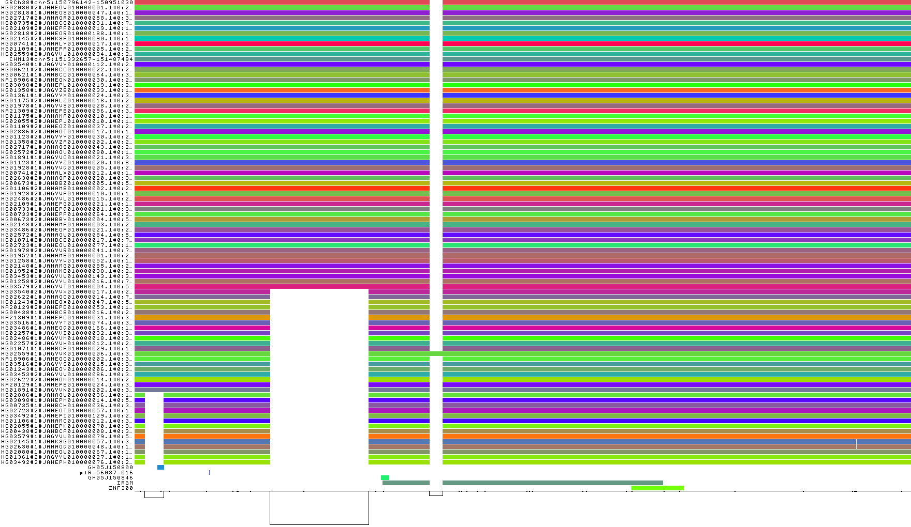

```{bash}
odgi untangle -R element-names.txt -i irgm-region-chr5-sorted-optimised-INJECT-ELEMENTS.og -j 0.5 -t 4 -g \
   | grep '^mol\|GRCh38\|CHM13\|^IRGM\|^GH05\|^piR\|^ZNF300\|HG01243#2\|HG01071#1\|HG00741#2\|HG00741#1' > irgm-ggplot-elements.tsv
```

In R:

```{r}
read.delim('irgm-ggplot-elements.tsv') %>%
  ggplot(., aes(xmin=start, xmax=end, y=molecule, fill=gene, forward=strand)) + geom_gene_arrow()
```

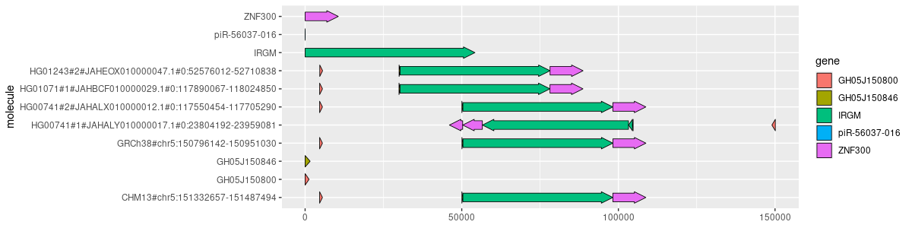

```{bash}
odgi flip -i irgm-region-chr5-sorted-optimised-INJECT-ELEMENTS.og -o - -t 4 \
    | odgi untangle -R element-names.txt -i - -j 0.5 -t 4 -g \
    | grep '^mol\|GRCh38\|CHM13\|^IRGM\|^GH05\|^piR\|^ZNF300\|HG01243#2\|HG01071#1\|HG00741#2\|HG00741#1' > irgm-ggplot-elements-flip.tsv
```

In R:

```{r}
read.delim('irgm-ggplot-elements-flip.tsv') %>% 
  ggplot(., aes(xmin=start, xmax=end, y=molecule, fill=gene, forward=strand)) + geom_gene_arrow()
```

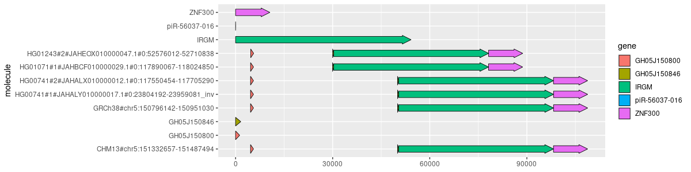


## VG (and sequenceTubeMap visualisation)

vg: variation graph

- GitHub: https://github.com/vgteam/vg
- Documentation: https://github.com/vgteam/vg/wiki
- Paper (vg toolkit): https://genomebiology.biomedcentral.com/articles/10.1186/s13059-020-1941-7


Download `vg` formatted graph for chromosome 5:

```{bash}
wget https://s3-us-west-2.amazonaws.com/human-pangenomics/pangenomes/freeze/freeze1/minigraph-cactus/hprc-v1.1-mc-grch38/hprc-v1.1-mc-grch38.chroms/chr5.vg
```

Index graph

```{bash}
./vg index -t 24 -x chr5.xg chr5.vg
```

Extract IRGM region ()

```
./vg find -x chr5.xg -p GRCh38#chr5:150796521-150950736 -E > irgm-region-chr5.vg
```

Count paths (same as for `og` format):

```{bash}
vg paths -x irgm-region-chr5.vg -L  | wc -l
```

```
90
```

Paths are unsorted (FYI):

```{bash}
vg paths -x irgm-region-chr5.vg -L  | sort | head
```

```
CHM13#chr5[50941507-182040985]
GRCh38#chr5
HG00438#1#JAHBCB010000016.1#0[13-95575657]
HG00438#2#JAHBCA010000008.1#0[3994-101973622]
HG00621#1#JAHBCD010000064.1#0[4914-59447805]
HG00621#2#JAHBCC010000022.1#0[983-104847779]
HG00673#1#JAHBBZ010000005.1#0[2914-76517265]
HG00673#2#JAHBBY010000004.1#0[2914-82914220]
HG00733#1#JAHEPQ010000001.1#0[0-110286294]
HG00733#2#JAHEPP010000064.1#0[2633-31442361]
```

### Preparing for SequenceTubeMap

Need to get vcf file:

```{bash}
wget https://s3-us-west-2.amazonaws.com/human-pangenomics/pangenomes/freeze/freeze1/minigraph-cactus/hprc-v1.1-mc-grch38/hprc-v1.1-mc-grch38.vcfbub.a100k.wave.vcf.gz
wget https://s3-us-west-2.amazonaws.com/human-pangenomics/pangenomes/freeze/freeze1/minigraph-cactus/hprc-v1.1-mc-grch38/hprc-v1.1-mc-grch38.vcfbub.a100k.wave.vcf.gz.tbi
```

Extract IRGM region on chromosome 5:

```{bash}
tabix hprc-v1.1-mc-grch38.vcfbub.a100k.wave.vcf.gz chr5:150796521-150950736 > irgm-region-chr5.vcf
```

Compress and index:

```{bash}
bgzip -c irgm-region-chr5.vcf > irgm-region-chr5.vcf.gz
tabix irgm-region-chr5.vcf.gz
```

### Install sequenceTubeMap

```{bash}
git clone https://github.com/vgteam/sequenceTubeMap.git
```

Also need `yarn` and `npm`. See: https://github.com/vgteam/sequenceTubeMap

Build via:

```{bash}
yarn build
```

Start server:

```{bash}
yarn serve
```

Browse at: http://localhost:3000

### View data via sequenceTubeMap

Details at: https://github.com/vgteam/sequenceTubeMap

Files needed:

```
irgm-region-chr5.vcf.gz
irgm-region-chr5.vcf.gz.tbi
irgm-region-chr5.vg
```

Use the `prepare_vg.sh` script (in `scripts` directory) to generate the data needed. For example:

```{bash}
./prepare_vg.sh ../mik-data/irgm-region-chr5.vg
```

Edit `src/config.json`:

```{json}
  "DATA_SOURCES": [
    {
      "name": "IRGM",
      "tracks": [
        {"trackFile": "mik-data/irgm-region-chr5.vg.xg", "trackType": "graph"},
        {"trackFile": "mik-data/irgm-region-chr5.vg.gbwt", "trackType": "haplotype"}
      ],
      "dataType": "built-in",
      "region": "GRCh38#chr5:1-150000"
    },

```

and

```{json}
  "vgPath": "",
  "dataPath": "mik-data/",
```

MIGHT need to run `yarn build` again after this, then `yarn serve`.

It works!

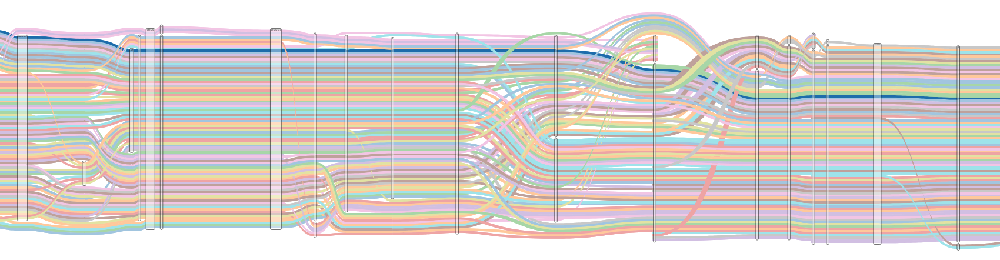

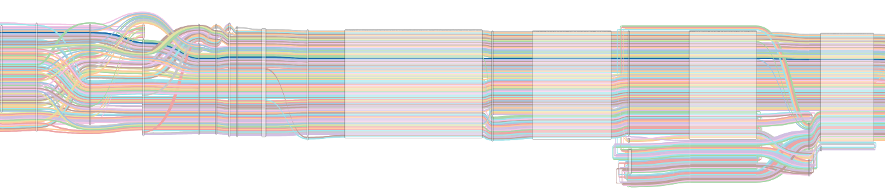

